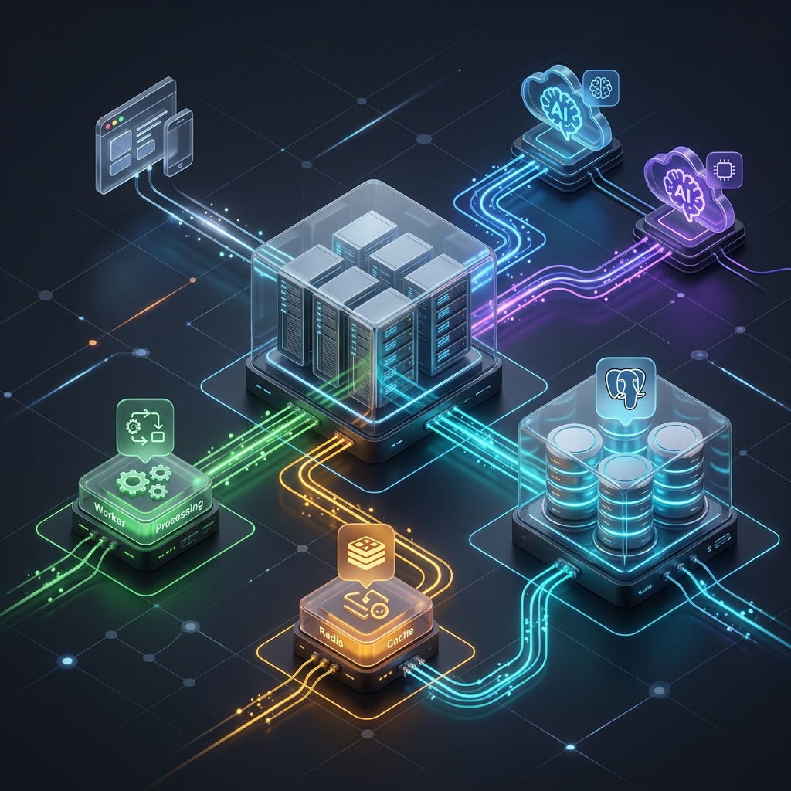

# Arquitectura del Sistema: Express + BullMQ

Aquí tienes la representación visual conceptual generada y el diagrama técnico exacto de cómo está estructurada nuestra arquitectura tras la adopción de BullMQ y los Workers de IA en segundo plano.

## Representación Conceptual



> [!NOTE]
> La imagen superior es una representación visual isométrica que ilustra de forma abstracta el flujo de datos entre las aplicaciones frontend, el clúster de base de datos relacional, el nodo en caché (Redis) y los workers asíncronos procesando llamadas a APIs de inteligencia artificial.

---

## Diagrama Técnico (Mermaid)

Este diagrama representa con exactitud técnica los flujos, puertos y servicios que hemos implementado, separando el ciclo de eventos principal de las tareas asíncronas pesadas (como generación de imágenes o transcripción de audio).

```mermaid
flowchart TB
    %% Definición de estilos
    classDef frontend fill:#3b82f6,stroke:#1d4ed8,stroke-width:2px,color:#fff
    classDef backend fill:#10b981,stroke:#047857,stroke-width:2px,color:#fff
    classDef worker fill:#8b5cf6,stroke:#6d28d9,stroke-width:2px,color:#fff
    classDef database fill:#f59e0b,stroke:#b45309,stroke-width:2px,color:#fff
    classDef ai fill:#ef4444,stroke:#b91c1c,stroke-width:2px,color:#fff

    subgraph "Capa de Cliente (Frontend / Bots)"
        Wati["Wati App\n(React/Vite)"]:::frontend
        Admin["More-Admin\n(React/Vite)"]:::frontend
        Telegram["Telegram Bot\n(Webhooks)"]:::frontend
    end

    subgraph "Capa de Servidor (Node.js)"
        API["Express API Server\n(server.js)"]:::backend
        JobPoller["Endpoint /api/jobs\n(Polling)"]:::backend
        
        API -.-> JobPoller
    end

    subgraph "Infraestructura & Estado"
        PG[(PostgreSQL\nwati_db)]:::database
        Redis[(Redis Queue\nai-jobs)]:::database
    end

    subgraph "Capa de Procesamiento Asíncrono"
        Worker["BullMQ AI Worker\n(worker.js)"]:::worker
        ImageGen["Generación de Imágenes\n(GeminiService)"]:::worker
        AudioTrans["Transcripción Audio\n(Groq Whisper)"]:::worker
        
        Worker --> ImageGen
        Worker --> AudioTrans
    end

    subgraph "Servicios Externos AI"
        GoogleAI["Google Gemini API"]:::ai
        GroqAI["Groq Cloud API"]:::ai
    end

    %% Conexiones de Cliente a Servidor
    Wati -->|Solicitudes REST| API
    Admin -->|Generar Receta / Importar| API
    Telegram -->|Audios / Imágenes / Texto| API
    Wati -->|Consultar progreso| JobPoller
    Admin -->|Consultar progreso| JobPoller

    %% Conexiones de Servidor a BD/Cola
    API <-->|Lectura/Escritura CRUD| PG
    API -->|Encola tareas (aiQueue.add)| Redis
    JobPoller <-->|Consulta Job.getState()| Redis

    %% Conexiones de Worker a BD/Cola/APIs
    Redis -->|Consume tareas (processJob)| Worker
    Worker <-->|Actualiza DB / URL de imagen| PG
    Worker -.->|Actualiza Progreso (10%, 80%)| Redis
    
    ImageGen <-->|HTTP Request| GoogleAI
    AudioTrans <-->|HTTP Request| GroqAI
```

### Flujo de Trabajo (Ejemplo: Generación de Imagen)
1. **Admin** solicita generar una imagen para una receta desde el Dashboard.
2. El **API Server (Express)** recibe el request, inserta el Job en **Redis (BullMQ)** y responde de inmediato con un `jobId` al cliente HTTP.
3. El cliente empieza a consultar (**JobPoller**) el estado usando `/api/jobs/:jobId`.
4. En segundo plano, el **Worker** toma el Job de Redis, llama a la API de **Gemini** y actualiza el progreso en Redis (10%, 30%, 80%).
5. Al finalizar exitosamente, el **Worker** guarda la URL de la imagen resultante en la tabla de **PostgreSQL**.
6. El cliente recibe el `status: completed` en su siguiente iteración de polling y muestra la imagen renderizada en pantalla.
